# HTML para dommies

## Etiquetas de Texto

* `<em></em>` Le da enfasis al texto

```html
<!-- Ejemplo -->

<em>Lorem ipsum dolor sit amet consectetur.</em>
```
**Salida**

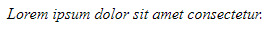

* `<i></i>` Texto en italico

```html
<!-- Ejemplo -->

<i>Lorem ipsum dolor sit amet consectetur.</i>
```
**Salida**

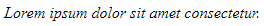

* `<span></span>` Contenedor de elementos en línia

```html
<!-- Ejemplo -->

<span>Lorem ipsum dolor sit amet consectetur.</span>
```
**Salida**

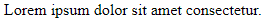

* `<mark></mark>` Remarca la relevancia

```html
<!-- Ejemplo -->

Lorem ipsum dolor <mark>sit amet consectetur.</mark>
```
**Salida**

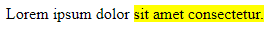

* `<b></b>` Pone la letra en negritas

```html
<!-- Ejemplo -->

Lorem ipsum dolor <b>sit amet consectetur.</b>
```
**Salida**

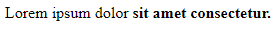

* `<u></u>` Subraya el texto

```html
<!-- Ejemplo -->

Lorem ipsum dolor <u>sit amet consectetur.</u>
```
**Salida**

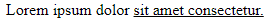

* `<strong></strong>` Importancia del texto

```html
<!-- Ejemplo -->

Lorem ipsum dolor <strong>sit amet consectetur.</strong>
```
**Salida**

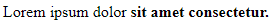

* `<small></small>` El texto no tiene importancia

```html
<!-- Ejemplo -->

Lorem ipsum dolor <small>sit amet consectetur.</small>
```
**Salida**

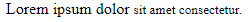

* `<s></s>` El texto se tacha

```html
<!-- Ejemplo -->

Lorem ipsum dolor <s>sit amet consectetur.</s>
```
**Salida**

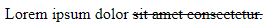

* `<cite></cite>` Mención a un proyecto

```html
<!-- Ejemplo -->

Lorem ipsum dolor <cite>sit amet consectetur.</cite>
```
**Salida**

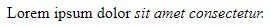

* `<sup></sup>` Superíndice

```html
<!-- Ejemplo -->

x<sup>2</sup> + 1 = 0
```
**Salida**

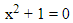

* `<sub></sub>` Subíndice

```html
<!-- Ejemplo -->

H<sub>2</sub>O
```
**Salida**

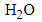

___

## Títulos

```html
    <h1>Hola Mundo!!</h1>
    <h2>Hola Mundo!!</h2>
    <h3>Hola Mundo!!</h3>
    <h4>Hola Mundo!!</h4>
    <h5>Hola Mundo!!</h5>
    <h6>Hola Mundo!!</h6>
```
**Salida**

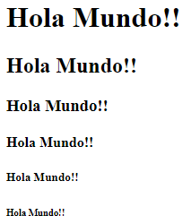

___

## Plantilla Semántica Página Web

```html
<!DOCTYPE html>
<html lang="en">
<head>
    <meta charset="UTF-8">
    <meta http-equiv="X-UA-Compatible" content="IE=edge">
    <meta name="viewport" content="width=device-width, initial-scale=1.0">
    <link rel="stylesheet" href="Styles.css">
    <title>Main</title>
</head>
<body>
    <!-- Plantilla semántica HTML para una página -->
    <header>
        <nav>
            <ul>
                <li><a href="#">Menu 1</a></li>
                <li><a href="#">Menu 2</a></li>
                <li><a href="#">Menu 3</a></li>
            </ul>
        </nav>
    </header>
    <main>
        <section>
            <p>Lorem ipsum dolor sit amet consectetur adipisicing elit. Perferendis, soluta.</p>
        </section>
        <aside>
            <p>Lorem ipsum dolor sit amet consectetur adipisicing.</p>
        </aside>
        <article>
            <span>Hola Mundo!!</span>
        </article>
    </main>
    <footer>
        <strong>Derechos Luciano 2021</strong>
    </footer>
</body>
</html>
```
___

## Anclas

Mediante `id=""` se puede unir links con secciones de la página

> _id es único_ 

```html
<!DOCTYPE html>
<html lang="en">
<head>
    <meta charset="UTF-8">
    <meta http-equiv="X-UA-Compatible" content="IE=edge">
    <meta name="viewport" content="width=device-width, initial-scale=1.0">
    <title>Main</title>
    <style>
        *{
            scroll-behavior: smooth;
        }
        img{
            width: 400px;
        }
    </style>
</head> 
<body>
    <!-- Imágenes no incluidas -->
    <section id="euler">
        
        <nav>
            <a href="#euler">Euler</a>
            <a href="#gauss">Gauss</a>
            <a href="#euclid">Euclid</a>
        </nav>
    </section>
    <div>
        <br><br><br><br><br><br><br><br><br><br><br><br><br><br><br><br><br><br><br><br><br><br><br><br><br><br><br><br><br><br>
    </div>
    <section id="gauss">
        
        <nav>
            <a href="#euler">Euler</a>
            <a href="#gauss">Gauss</a>
            <a href="#euclid">Euclid</a>
        </nav>
    </section>
    <div>
        <br><br><br><br><br><br><br><br><br><br><br><br><br><br><br><br><br><br><br><br><br><br><br><br><br><br><br><br><br><br>
    </div>
    <section id="euclid">
        
        <nav>
            <a href="#euler">Euler</a>
            <a href="#gauss">Gauss</a>
            <a href="#euclid">Euclid</a>
        </nav>
    </section>
    <div>
        <br><br><br><br><br><br><br><br><br><br><br><br><br><br><br><br><br><br><br><br><br><br><br><br><br><br><br><br><br><br>
    </div>
</body>
</html>

```

___

## Formularios

```html
<!DOCTYPE html>
<html lang="en">
<head>
    <meta charset="UTF-8">
    <meta http-equiv="X-UA-Compatible" content="IE=edge">
    <meta name="viewport" content="width=device-width, initial-scale=1.0">
    <link rel="stylesheet" href="Styles.css">
    <style>
        *{
            scroll-behavior: smooth;
        }
    </style>
    <title>Mi web</title>
</head>
<body>  
   <table>
       <caption>Matemáticos</caption>
       <tr>
           <th>Euler</th>
           <th>Gauss</th>
           <th>Euclid</th>
       </tr>
       <tr>
           <td>Formula</td>
           <td>Campana</td>
           <td>PI</td>
       </tr>
       <tr>
           <td>Reflection</td>
           <td>Gamma</td>
           <td>Primes</td>
       </tr>
   </table>

   <h2>Formulario</h2>
   <form action="">
       <label for="name">Nombre</label>
       <input type="text" minlength="4" name="" id="name" placeholder="Nombre:" required>
       <br><br>
       <label for="lastname">Apellido</label>
       <input type="text" minlength="4" name="" id="lastname" placeholder="Apellido:" required>
       <br><br>
       <label for="mail">Email</label>
       <input type="email" name="" id="email" placeholder="Correo:" required>
       <br><br>
       <label for="password">Contraseña</label>
       <input type="password" name="" id="password" placeholder="Contraseña:" required>
       <br><br>
       <label for="color">Color</label>
       <input type="color" name="" id="color" placeholder="Color:" required>
       <br><br>
       <label for="number">Numero</label>
       <input type="number" name="" id="number" placeholder="Numero:" required>
       <br><br>
       <label for="date">Fecha</label>
       <input type="date" name="" id="date" placeholder="Fecha:" required>
       <br><br>
       <input type="submit" value="Enviar">
       <input type="reset" value="Resetear">
   </form>

   <h2>Selecciona tema</h2>
   <select name="" id="">
       <option value="">algebra</option>
       <option value="" selected>calculo</option>
       <option value="">aritmetica</option>
       <option value="">geometria</option>
   </select>  

   <h2>Jornada</h2>
   <label for="jornada">
       <input type="radio" id="jornada" name="jornada">Mañana
   </label>
   <label for="jornadan">
       <input type="radio" id="jornadan" name="jornada">Noche
   </label>
   <label for="jornadam">
       <input type="radio" id="jornadam" name="jornada">Mixta
   </label>

   <h2>Termnios y Condiciones</h2>
   <label for="tyc">
       <input type="checkbox" name="" id="tyc">Terminos y Condiciones
   </label>
   <br><br>
   <textarea name="" id="" cols="30" rows="10"></textarea>
</body>
</html>
```

___

## Etiquetas Formularios

```html
<!DOCTYPE html>
<html lang="en">
  <head>
    <meta charset="UTF-8" />
    <meta http-equiv="X-UA-Compatible" content="IE=edge" />
    <meta name="viewport" content="width=device-width, initial-scale=1.0" />
    <title>Main</title>
  </head>
  <body>
    <address>
      Contactame <a href="#">a mi correo</a> <br />
      Direccion 781t #78-9 <br />
      Telefono [3873987119]
    </address>
    <br /><br /><br />
    <form>
      <fieldset>
        <legend>Datos</legend>
        <label for="">Nombre</label>
        <select name="" id="">
          <optgroup label="EULER">
            <option value="EULER">Euler #1</option>
            <option value="EULER">Euler #2</option>
          </optgroup>
          <optgroup label="GAUSS">
            <option value="GAUSS" selected>GAUSS #1</option>
            <option value="GAUSS">GAUSS #2</option>
          </optgroup>
          <optgroup label="EUCLID">
            <option value="EUCLID">EUCLID #1</option>
            <option value="EUCLID">EUCLID #2</option>
          </optgroup>
        </select>
      </fieldset>
      <br /><br />
      <!-- busqueda detallada -->
      <label for="">Matmático</label>
      <input list="math" />
      <datalist id="math">
        <option value="EULER">Euler #1</option>
        <option value="EULER">Euler #2</option>
        <option value="GAUSS" selected>GAUSS #1</option>
        <option value="GAUSS">GAUSS #2</option>
        <option value="EUCLID">EUCLID #1</option>
        <option value="EUCLID">EUCLID #2</option>
      </datalist>
    </form>
    <br>
    <h1 contenteditable="true">Hola Mundo</h1>

  </body>
</html>
```

___

## Iframe

Coloca información de otras páginas dentro de una propia

> _Nota: solo funciona con sitios no protegidos_

```html
<!DOCTYPE html>
<html lang="en">
<head>
    <meta charset="UTF-8">
    <meta http-equiv="X-UA-Compatible" content="IE=edge">
    <meta name="viewport" content="width=device-width, initial-scale=1.0">
    <title>Main</title>
</head>
<body>
    <h1>Hola</h1>
    <iframe width="560" height="315" src="https://www.youtube.com/embed/nJxtUF4Dd1U" title="YouTube video player" frameborder="0" allow="accelerometer; autoplay; clipboard-write; encrypted-media; gyroscope; picture-in-picture" allowfullscreen></iframe>
</body>
</html>
```

___

## Picture

Se usa para imágenes mas que todo en diseño responsive

```html
<!DOCTYPE html>
<html lang="en">
<head>
    <meta charset="UTF-8">
    <meta http-equiv="X-UA-Compatible" content="IE=edge">
    <meta name="viewport" content="width=device-width, initial-scale=1.0">
    <title>Main</title>
    <style>
        img{
            width: 400px;
        }
    </style>
</head>
<body>
    <!-- Imágenes no incluidas -->
    <picture>
        
        <figcaption>Euclides</figcaption>
    </picture>

    <picture>
        <source srcset="./img/gauss.jpg" media="(min-width:500px)">
        <source srcset="./img/leonhard-euler-biography.jpg" media="(min-width:200px)">
        
    </picture>

    <details>
        <summary>Teoremas</summary>
        <ul>
            <li>Campana</li>
            <li>Suma</li>
            <li>Producto</li>
        </ul>
        <p>Lorem, ipsum dolor sit amet consectetur adipisicing elit. Ad, ullam.</p>
    </details>
</body>
</html>
```

___

## Video

```html
<!DOCTYPE html>
<html lang="en">
<head>
    <meta charset="UTF-8">
    <meta http-equiv="X-UA-Compatible" content="IE=edge">
    <meta name="viewport" content="width=device-width, initial-scale=1.0">
    <title>Main</title>
</head>
<body>
    <!-- Video no incluido -->
    <video src="./video/Formula_Cuadratica.mp4" width="400px" controls muted loop poster="./video/Portada_ManimCE_v0.8.0.png"></video>

    <audio src="" controls></audio>
</body>
</html>
```

___

## Metadatos Principales

```html
<!DOCTYPE html>
<html lang="en">
<head>
    <meta charset="UTF-8">
    <meta http-equiv="X-UA-Compatible" content="IE=edge">
    <meta name="viewport" content="width=device-width, initial-scale=1.0">
    <!-- Descripcion pagina -->
    <meta name="description" content="Bienvenidos a la pagina, esta es la descripcion">
    <meta name="author" content="Luciano Chavarria">
    <link rel="stylesheet" href="Styles.css">
    <title>Main</title>
</head>
<body>
    <h1>
        Hola Mundo!!
    </h1>
</body>
<script src="Main.js"></script>
</html>
```

___

## Emmet

Plugin que permite escribir HTML mas rapido

```html
<!DOCTYPE html>
<html lang="en">
<head>
    <meta charset="UTF-8">
    <meta http-equiv="X-UA-Compatible" content="IE=edge">
    <meta name="viewport" content="width=device-width, initial-scale=1.0">
    <title>Main</title>
</head>
<body>
    <!-- nav>(li>a.link$@0#menu[href="#"]{Opcion $})*4 -->
    <!-- $$ cantidad de ceros -->
    <div class="inicio">
        <nav>
            <li><a href="#" class="link0" id="menu">Opcion 1</a></li>
            <li><a href="#" class="link1" id="menu">Opcion 2</a></li>
            <li><a href="#" class="link2" id="menu">Opcion 3</a></li>
            <li><a href="#" class="link3" id="menu">Opcion 4</a></li>
        </nav>
    </div>

    <!-- .main>section>p+a+h2+h1 -->
    <div class="main">
        <section>
            <p></p>
            <a href=""></a>
            <h2></h2>
            <h1></h1>
        </section>
    </div>
    <!-- footer>.final>a{final $}*3^h1{hola} -->
    <!-- ^^^ cantidad de niveles que asciende -->
    <footer>
        <div class="final"><a href="">final 1</a><a href="">final 2</a><a href="">final 3</a></div>
        <h1>hola</h1>
    </footer>
</body>
</html>
```
